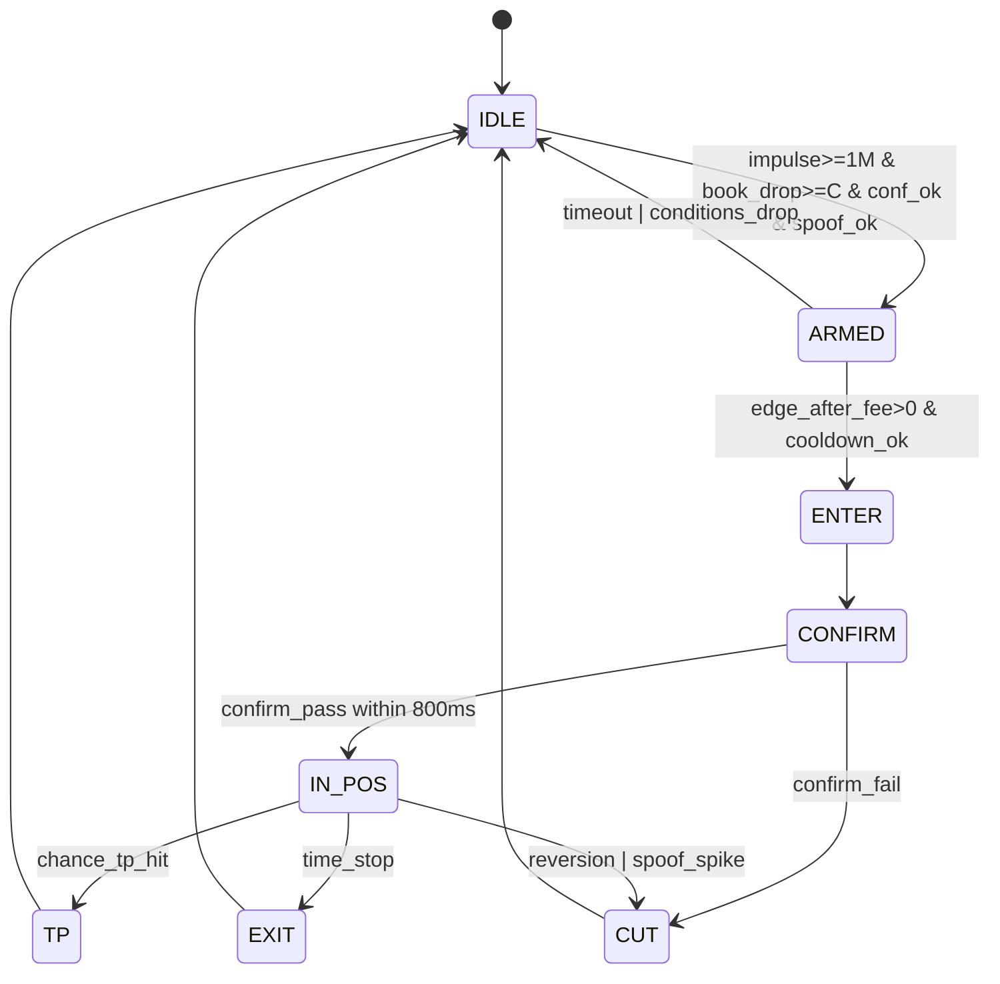

오케이. 지금까지 합의된 내용(β는  **실시간 변화** , 진입은 **$1M+ 체결+오더북 소모**로 “선행”하고, Chainlink/price-to-beat은 **진입 후 confirmation**으로만 쓰고(F3 재배치), F4는  **스푸핑/페이크벽으로 오더북 신호 품질을 망치는 구간 필터** , 수수료는 15m  **taker fee 곡선** , 백테스트 대신  **실마켓 섀도우 트레이딩** )을 반영한 **설계도 v2.1 (코덱스 구현용 스펙)** 드릴게.

---

## 0) 시스템 한 줄 요약

**“거래소 임펄스($1M+ 단일 체결) + 오더북 실제 소모”로 즉시 진입 → 200~800ms 안에 Chainlink/price-to-beat이 같은 방향으로 따라오면 유지, 아니면 즉시 컷 → 수수료(특히 0.50 근처) 포함 기대값이 양수일 때만 실행.**

---

## 1) 데이터 소스 (권장 구성)

### 1.1 Polymarket 실시간

* 마켓 호가: `yes_bid/ask`, `no_bid/ask` (최소 best 레벨)
* `price_to_beat` (UI에 나오는 임계값)
* (가능하면) 마켓 체결/호가 갱신 스트림

### 1.2 Chainlink BTC-USD 실시간

* 가능하면 Polymarket RTDS의 `crypto_prices_chainlink`로 받는 게 깔끔함. ([Polymarket Documentation](https://docs.polymarket.com/developers/RTDS/RTDS-crypto-prices?utm_source=chatgpt.com "RTDS Crypto Prices"))

### 1.3 메이저 거래소 (Binance spot BTCUSDT 권장)

* Trades: `price, qty, ts, (aggressor side)`
* Orderbook top10/top20 snapshot(or delta)

> 참고: Polymarket RTDS에는 Binance source(`crypto_prices`)도 따로 있어 “가격 비교/동기화”에 편함. ([Polymarket Documentation](https://docs.polymarket.com/developers/RTDS/RTDS-crypto-prices?utm_source=chatgpt.com "RTDS Crypto Prices"))

---

## 2) 핵심 파라미터(초기값)

```text
W_BETA_SEC = 60                 # β 추정 윈도우
DELTA_MS = 300                  # x=ΔP_exch 계산 간격
LAG_MS_INIT = 500               # lag 초기값
BETA_SMOOTH = 0.10              # β EMA 갱신 비율
BETA_CLAMP = [0.0, 1.0]

IMPULSE_USD_MIN = 1_000_000     # 단일 체결 기준
SWEEP_USD_MIN = 1_500_000       # 300~500ms 누적 공격 체결(옵션, 더 빡세게)
BOOK_CONSUME_USD_MIN = 800_000  # 오더북 소모(추정) 기준

CONFIRM_WIN_MS = 800            # 진입 후 확인창
CONFIRM_EPS_USD = 5             # Chainlink/ptb 방향성 확인 최소 이동(튜닝)

SCALP_TP_PCTPT = 3.0            # chance +3%p면 익절(예시)
TIME_STOP_MS = 3500             # 스켈프면 짧게
COOLDOWN_MS = 1500              # 중복진입 방지

SPOOF_SCORE_MAX = 1.0           # 넘으면 거래 금지
```

---

## 3) 실시간 β(t), lag(t) 추정 (전달계수 학습)

### 3.1 정의

* `x_t = ΔP_exch(t)` (예: 300ms 변화)
* `y_t = ΔP_oracle(t + lag)` (Chainlink 또는 Polymarket의 기준가격 proxy)
* `β(t) ≈ y_t / x_t` 의 **최근 W초 강건 추정치**

### 3.2 구현 스펙(강건/실전형)

1. 최근 W초 동안 샘플 수집: `(x_t, y_t)`
2. 필터:
   * `abs(x_t) < x_min` 샘플 제외 (노이즈 방지)
3. 추정:
   * `β_raw = median(y_t / x_t)`
4. 스무딩/클램프:
   * `β = (1 - BETA_SMOOTH)*β_prev + BETA_SMOOTH*β_raw`
   * `β = clamp(β, 0, 1)`
5. confidence:
   * 유효 샘플 개수 `n_eff`
   * 비율 분산 `mad(ratio)` (median absolute deviation)
   * `beta_conf = f(n_eff, mad)` (단순 점수로 0~1)

> 이 β는 네가 말한 대로 “지금 장”에서 계속 변하는 값이고, 우리는 매 틱 갱신한다(EMA로 튀는 것만 막음).

---

## 4) 피처(시그널 재료) 정의

### 4.1 임펄스(체결 기반)

* `impulse_usd = max(trade_price * trade_qty over last 500ms)`
* `sweep_usd = sum(aggressive_side_usd over last 300~500ms)` (가능하면 aggressor 기준)

### 4.2 오더북 소모(“진짜로 먹혔는지”)

스냅샷 기반 근사(TopN):

* `ask_liq_usd = Σ(ask_p[i] * ask_q[i]) i=0..N-1`
* `bid_liq_usd = Σ(bid_p[i] * bid_q[i]) i=0..N-1`
* 상승 충격(매수 스윕) 후보면:
  * `book_drop_usd = max(0, ask_liq_usd_prev - ask_liq_usd_now)`
* 하락 충격 후보면:
  * `book_drop_usd = max(0, bid_liq_usd_prev - bid_liq_usd_now)`

**중요:** 스냅샷만으로는 “체결로 줄었는지 / 취소로 빠졌는지” 구분이 약함 → 그래서 아래 스푸핑 점수와 함께 씀.

### 4.3 F4 스푸핑/페이크벽 점수(spoof_score)

의도: “오더북이 신뢰 안 되는 구간”에서 오더북 기반 시그널을 못 쓰게 만들기.

간단한 델타 기반 탐지:

* 각 레벨별로 `Δq = q_now - q_prev`
* “급증 후 급감” 패턴 카운트:
  * `Δq > +Q_BIG` 발생 후 `T<=800ms` 내 `Δq < -Q_BIG`가 같은 가격대에서 발생하면 +1
* 또는 더 단순히:
  * `book_drop_usd`가 큰데 `sweep_usd`가 작으면 **취소/철회** 가능성↑
    * `spoof_score += sigmoid((book_drop_usd - sweep_usd)/K)`

사용:

* `spoof_score > SPOOF_SCORE_MAX`면 **진입 금지**
* 또는 `beta_conf`에 패널티를 줘도 됨(신호 신뢰도 하락)

---

## 5) 진입 로직 (중요: chance 튀기 “전”에 들어가도록)

### 5.1 방향 판단

* `dir = sign(ΔP_exch_now)` (상승이면 UP 후보, 하락이면 DOWN 후보)

### 5.2 “임계 넘김” 예측 (β로)

* 현재 오라클(Chainlink) 가격: `O_now`
* price-to-beat: `PTB`
* 거래소 즉시 변화: `ΔP_exch_now`
* 예측 오라클 반응: `ΔO_pred = β * ΔP_exch_now`
* 예측 오라클: `O_pred = O_now + ΔO_pred`

**Up 유리 조건(개념):** `O_pred - PTB`가 더 커지는 방향
**Down 유리 조건:** `O_pred - PTB`가 더 작아지는 방향

> 여기서 “넘길 수 있냐”를 수치로 만들려면 `margin_pred = (O_pred - PTB)`를 쓰면 됨.

### 5.3 진입 게이트(너가 지정한 기준이 1순위)

```text
if impulse_usd >= 1M
and book_drop_usd >= BOOK_CONSUME_USD_MIN
and beta_conf >= conf_min
and spoof_score <= SPOOF_SCORE_MAX
and expected_edge_after_fee > 0
then ENTER(dir)
```

---

## 6) F3 재배치: 진입 후 Confirmation(200~800ms) → 실패 시 즉시 컷

### 6.1 왜 이렇게?

너 말대로 “chance가 튄 걸 보고 들어가면 늦다.”
그래서  **진입은 거래소 임펄스 기반으로 먼저** , 대신 “가짜 이격”을 빠르게 걸러야 하니까 **진입 직후 확인창**을 둔다.

### 6.2 확인 조건(예시)

* 진입 시각 `t0`
* `t0 + CONFIRM_WIN_MS` 안에:
  * `sign(ΔChainlink) == dir` AND `abs(ΔChainlink) >= CONFIRM_EPS_USD`
  * 또는 `price_to_beat 관련 proxy`가 같은 방향으로 움직임
* 만족하면 `IN_POS` 유지
* 못 만족하면 `CUT` (초단기 손절 / 즉시 청산)

---

## 7) 수수료 모델(15m taker fee curve) + 기대값 필터

Polymarket 문서 기준, 15m 크립토 마켓 taker fee는 가격(확률) 0.50에서 최대 **1.56%**로 가장 크고 양 극단으로 갈수록 줄어듦. ([Polymarket Documentation](https://docs.polymarket.com/polymarket-learn/trading/maker-rebates-program?utm_source=chatgpt.com "Maker Rebates Program"))

### 7.1 구현(테이블 보간이 가장 간단)

문서 “Fee Table (100 shares)”를 포인트로 박고 선형 보간:

* 입력: `p`(0~1), `shares`
* 출력: `fee_usdc_est`
* 100 shares 기준 fee를 `fee_100(p)`로 만들고,
  * `fee_usdc = fee_100(p) * (shares / 100)`

(문서 포인트 예: p=0.50, 100 shares면 fee=0.78 USDC, effective 1.56%가 최대) ([Polymarket Documentation](https://docs.polymarket.com/polymarket-learn/trading/maker-rebates-program?utm_source=chatgpt.com "Maker Rebates Program"))

### 7.2 기대값 필터

```text
edge_est_usdc = expected_move_in_contract_value - slippage_est - latency_penalty
if edge_est_usdc <= fee_usdc_est: 거래 금지
```

---

## 8) 포지션 관리(스켈프 중심)

### 8.1 익절(스켈프)

* 진입 후 `chance`가 `+SCALP_TP_PCTPT(%p)` 유리하게 움직이면 즉시 청산

### 8.2 타임스탑

* `TIME_STOP_MS` 경과하면 청산(가짜 이격/되돌림을 오래 끌지 않게)

### 8.3 추가 컷

* Confirmation 실패
* 급반전(reversion) + spoof_score 급증

---

## 9) 상태머신(구현 필수)



---

## 10) “백테스트 대신 실마켓 섀도우 트레이딩” 스펙

### 10.1 Shadow Fill 규칙(최소 구현)

* 매수 fill = 당시 `best_ask`
* 매도 fill = 당시 `best_bid`
* fee = 7장 모델로 추정
* slippage = `k * spread` (보수적으로 시작)

### 10.2 기록 파일(이걸 모으면 너만의 백테스트 데이터가 생김)

* `raw_exch_trades.parquet`
* `raw_exch_book.parquet`
* `raw_chainlink.parquet`
* `raw_pm_quotes.parquet`
* `signals.parquet` (β, conf, impulse, book_drop, spoof_score, margin_pred, edge_est)
* `paper_fills.parquet` (entry/exit/fee/pnl/latency)

### 10.3 KPI(유효성 판정)

* confirm pass rate
* 평균 lead time(신호→chainlink 반응)
* net pnl after fee
* spoof 필터 ON/OFF 비교

---

## 11) 실행 어댑터(Polypannel 연동) — 안전한 전제

* “원클릭” UX는 가능해도, 실제 주문은 **정상 인증/권한(키/세션/지갑 allowance 등)** 흐름을 전제로 해야 함. (웹소켓/API도 키가 필요하다는 식의 가이드는 문서에 존재) ([Polymarket Documentation](https://docs.polymarket.com/quickstart/websocket/WSS-Quickstart?utm_source=chatgpt.com "WSS Quickstart"))
* (지갑 기반이면) 컨트랙트 allowance는 사전 세팅이 필요할 수 있음. ([NautilusTrader](https://nautilustrader.io/docs/nightly/integrations/polymarket/?utm_source=chatgpt.com "Polymarket | NautilusTrader Documentation"))

전략 엔진이 호출하는 인터페이스는 4개로 고정:

```ts
interface Exec {
  buyYes(shares: number): Promise<void>
  sellYes(shares: number): Promise<void>
  buyNo(shares: number): Promise<void>
  sellNo(shares: number): Promise<void>
}
```

Shadow/Live 스위치:

* `ShadowExec`: fill만 기록
* `LiveExec`: polypannel 기존 트레이딩 호출로 연결(내부 구현은 레포에 맞춰 붙임)

---

## 12) 코덱스에게 그대로 던질 “구현 지시문”(복붙용)

```text
목표: Polymarket 15m BTC Up/Down 마켓 섀도우 트레이딩 봇 구현.
전략: 거래소에서 $1M+ 단일 체결(impulse_usd) + 오더북 소모(book_drop_usd)가 동시에 발생하면 즉시 진입(UP/DOWN).
β(t): 최근 60초 슬라이딩 윈도우로 ΔP_exch와 ΔChainlink(t+lag)에서 median(y/x)로 추정하고 EMA로 스무딩(0~1 클램프). beta_conf 계산.
진입 후 800ms confirmation: Chainlink 또는 price-to-beat proxy가 같은 방향으로 최소 ε 이상 움직이면 유지, 아니면 즉시 컷.
F4 spoof_score: book_drop_usd >> sweep_usd(300ms 공격체결)일수록 spoof_score 증가. spoof_score 임계 초과 시 거래 금지.
수수료: Polymarket 15m taker fee curve 사용. Maker Rebates Program 문서의 100 shares fee table 포인트를 선형 보간해 fee_usdc를 계산. edge_after_fee<=0이면 거래 금지.
백테스트 대신 실마켓 섀도우: best bid/ask로 가상 체결, fee/slippage 반영하여 paper PnL 기록.
상태머신(IDLE→ARMED→ENTER→CONFIRM→IN_POS→TP/EXIT/CUT) 구현.
로그: raw_* parquet + signals.parquet + paper_fills.parquet. KPI 산출(confirm pass rate, net pnl after fee, lead time).
```

---

다음 단계로, 네가 원하면  **“구체 수식/임계값 튜닝을 위한 실전 체크리스트”** (예: BOOK_CONSUME_USD_MIN을 장별로 자동 조절하는 방법, CONFIRM_EPS를 변동성 기반으로 잡는 방법)까지 같이 붙여줄 수 있어.

그리고 polypannel 레포의  **핵심 트레이딩 호출 부분 파일 1~2개만 붙여주면** , 위 `LiveExec`를 “정확히 그 레포 구조에 맞춰” 어디에 어떤 코드로 끼우는지까지 바로 내려줄게.
